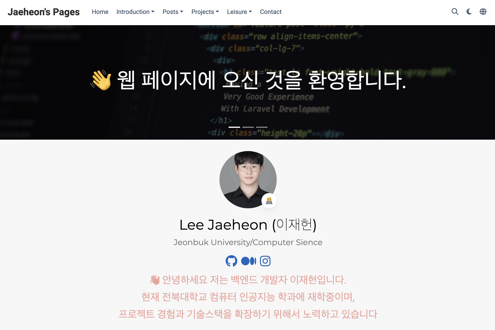

# Hugo 템플릿을 이용한 개인 포트폴리오
 

# 소개
이 repository는 2jaeheon.site에서 호스팅되는 개인 포트폴리오 웹사이트를 위한 것입니다. 블로그 포스트, 프로젝트, 취미, 독후감 등이 포함되어 있으며, Hugo 정적 사이트 생성기를 사용하여 제작되었습니다. 

# 주요기능
- 블로그 섹션: gHard Skill과 Soft SKill에 대한 블로그 포스트를 제공합니다.
- 자기소개: 자기소개 및 경력, 수상이력에 관한 내용을 제공합니다.
- 프로젝트 섹션: 내가 작업한 프로젝트에 대한 세부 내용을 제공합니다.
- 취미: 개인적인 관심사와 취미에 대한 글을 모아둔 섹션입니다.
- 독후감: 읽은 책에 대한 리뷰와 생각을 공유합니다.
- 연락: 지도와 어떻게 연락할 수 있는 방법을 제공합니다.

 

# 사이트 구조
1. 콘텐츠 구성
  - 블로그 아티클은 Hard skill과 Soft Skill로 분류하여 유형별로 정리하였고, 상단의 메뉴바에서 모든 포스트를 볼 수 있도록 구현하였습니다.
  - 프로젝트는 Web과 CS로 구분하여 각 프로젝트별로 볼 수 있도록 구현하였습니다.
  - 자기소개는 경력, 학교, 수상이력으로 분류하여 보기 편하도록 구현하였습니다.

   

2. 디자인 및 레이아웃
  - 각 컨텐츠가 웹 또는 모바일에서 둘 다 보기 쉽도록 구현하였습니다.
  - 각 컨텐츠는 목록 및 상세보기가 가능하도록 템플릿을 적절히 사용하였습니다.
  - 메인페이지에서 최대한 많은 정보를 간략하게 볼 수 있도록 각 카드별로 적절한 view를 선택하였습니다.
  - 카드 및 목록 뷰의 디자인 개선을 위해 상호작용 요소(호버 효과 등)를 추가하고, 사용자 경험을 개선했습니다.

 

3.	사용한 라이브러리
	-	Leaflet 같은 라이브러리로 인터랙티브한 지도 기능을 구현하였습니다.
  - GitHub Actions를 사용하여 정적 사이트를 자동으로 빌드 및 배포하도록 설정했습니다.
    
     

4.	어려움
	- 구조를 깔끔하게 유지하는 것이 어려웠습니다.
	- 디자인 수정: 내가 원하는 디자인을 적용하려면 CSS와 Hugo 템플릿 로직에 대한 깊은 이해가 필요했습니다.
	- 최적화: 다양한 리소스(지도, 미디어 파일 등)를 불러오면서 사이트의 로딩 속도를 빠르게 유지하는 것이 도전이었지만, 최종 결과는 만족스러웠습니다.

 

# 배포
이 웹사이트는 GitHub Pages를 통해 Hugo와 GitHub Actions를 사용하여 자동으로 배포됩니다. main 브랜치에 변경 사항을 푸시할 때마다 사이트가 다시 빌드되고 라이브 URL로 게시됩니다.
