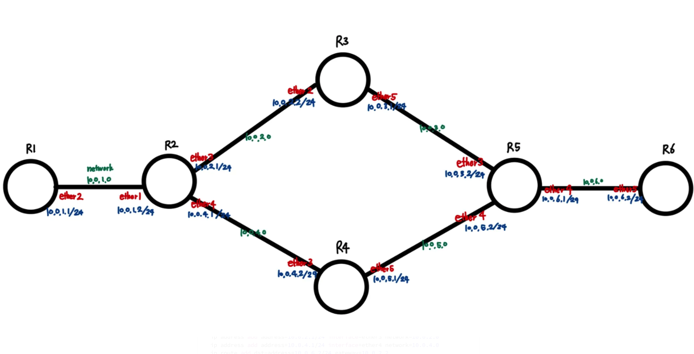

In this article, we used an Intel CPU, window Hyper-V GNS3 VM, and the router image was done using Microtik CHR. How to add additional Microtik CHR and how to connect the router to bring up the console window is beyond the scope of this article.

When we communicate, we need to send data to a specific network, and we do this by breaking the data into pieces. These pieces are called packets, and in order to send these packets to a specific network, they have to pass through a lot of routers along the way. A router is a gateway that forwards data between one or more local area networks (LANs). Data packets must be forwarded via the shortest or best path, so routers use something called a routing table to determine the path of packets to forward for the best delivery.

Routing tables can be divided into static and dynamic routing: static routing is how network administrators manually set up routing tables, while dynamic routing is how the network automatically establishes and updates routes. In this lab, we're going to set up a static routing table.

Here are the conditions
There are six routers, which we'll call R1 through R6 for convenience. R1 and R6 are the two ends, with the goal of sending data from R1 to R6, and R6 to R1. We'll configure them so that when data packets are sent from R1 to R6, data should only be sent up the up path, and when data packets are sent from R6 to R1, data should only be sent down the down path.


First, we need to connect each router. When connecting R1 and R2, I set the interface to ehter2 for R1 and ether1 for R2. I also connected R1 through R6 in the same way. After that, you need to set up the interfaces on each router through commands, and set up the routes on each router. After going through this process, it looks like this.


In this section, we'll learn how to set up interfaces on each router via commands.
```ip address add address=OOO.OOO.OOO.OOO/OO interface=인터페이스 이름 network=OOO.OOO.OOO.OOO
```

The above commands set up the interfaces and addresses.
Now we're going to set up IP addresses, or routes, for each router to communicate with external devices.

```ip route add dst-address=OOO.OOO.OOO.OOO/OO gateway=OO.OO.OO.OO
```
Use the above commands to set where to go and what the gateway is. For now, I've set up the following interfaces on each router for practice, from 10.0.1.1/24 to 10.0.6.1/24.



From R1, we only need to go through R3 to get to R6, and from R6 to R1, we only need to go through R4. So on R2, we set the gateway to 10.0.2.2 so that it goes through R3, and on R5, we set the gateway to 10.0.5.1 so that it goes through R4.

Let's just look at how to get from R1 to R6 (R6->R1 in reverse). On R1, when we set up the ip route, the destination is 10.0.6.2/24 and the gateway is 10.0.1.2. On R2, the destination is 10.0.6.2/24, and the gateway is 10.0.2.2. Similarly, to get from R1 to R6, all you need to do is tell all the routers to set the destination to 10.0.6.2, and the gateway to the next router up.

The full code looks like this

Translated with www.DeepL.com/Translator (free version)

```R1
ip address add address=10.0.1.1/24 interface=ether2 network=10.0.1.0
ip route add dst-address=10.0.6.2/24 gateway=10.0.1.2

R2
ip address add address=10.0.1.2/24 interface=ether1 network=10.0.1.0
ip address add address=10.0.2.1/24 interface=ether3 network=10.0.2.0
ip address add address=10.0.4.1/24 interface=ether4 network=10.0.4.0
ip route add dst-address=10.0.6.2/24 gateway=10.0.2.2
ip route add dst-address=10.0.1.1/24 gateway=10.0.1.1

R3
ip address add address=10.0.2.2/24 interface=ether2 network=10.0.2.0
ip address add address=10.0.3.1/24 interface=ether5 network=10.0.3.0
ip route add dst-address=10.0.6.2/24 gateway=10.0.3.2

R4
ip address add address=10.0.4.2/24 interface=ether2 network=10.0.4.0
ip address add address=10.0.5.1/24 interface=ether5 network=10.0.5.0
ip route add dst-address=10.0.1.1/24 gateway=10.0.4.1

R5
ip address add address=10.0.3.2/24 interface=ether3 network=10.0.3.0
ip address add address=10.0.5.2/24 interface=ether4 network=10.0.5.0
ip address add address=10.0.6.1/24 interface=ether6 network=10.0.6.0
ip route add dst-address=10.0.6.2/24 gateway=10.0.6.2
ip route add dst-address=10.0.1.1/24 gateway=10.0.5.1

R6
ip address add address=10.0.6.2/24 interface=ether5 network=10.0.6.0
ip route add dst-address=10.0.1.1/24 gateway=10.0.6.1
```