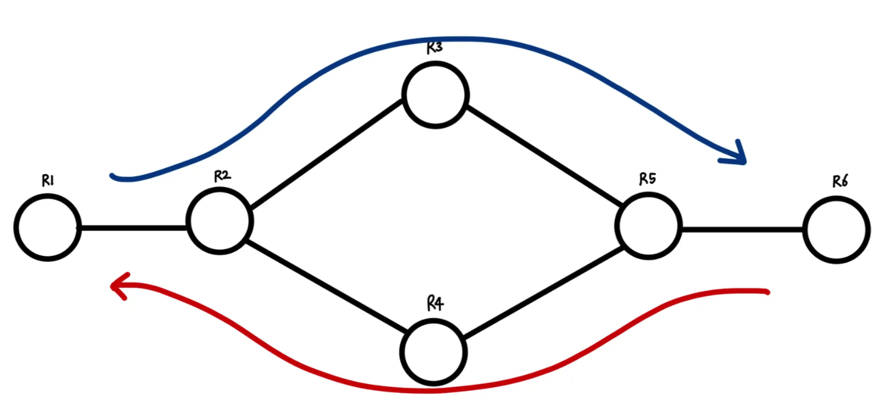
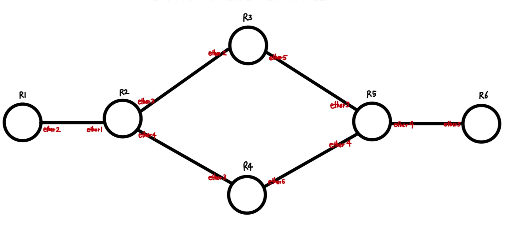
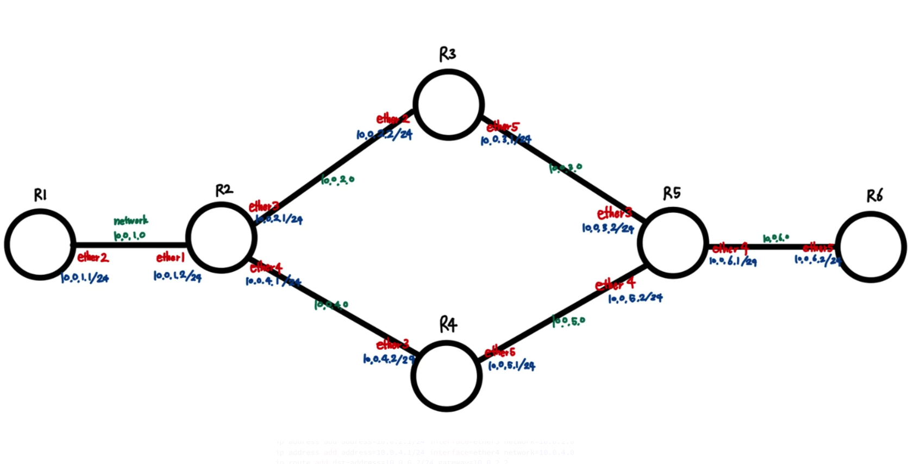

본 글에 들어가기 앞서 Intel CPU, window Hyper-V GNS3 VM를 사용하였으며 라우터 이미지는 Microtik CHR을 사용하여서 진행하였습니다. 추가로 Microtik CHR을 추가하는 방법과 라우터를 연결시켜서 콘솔 창을 띄우는 방법은 이 글에서 다루지 않습니다.

우리는 통신을 할 때 특정 네트워크로 데이터를 전송해야 하는데 이때 데이터를 일정 조각으로 쪼개서 보내게 됩니다. 이를 패킷(packet)이라고 하는데, 이 패킷을 특정 네트워크로 전송하기 위해서는 중간에 엄청나게 많은 라우터를 지나가야 합니다. 라우터는 한 개 이상의 근거리 통신망(LAN) 간에 데이터를 전달하는 게이트웨이입니다. 데이터 패킷은 최단 경로 또는 최적의 경로를 통해 전달되어야 합니다. 따라서 라우터에는 최선의 전달을 위해 전달할 패킷의 경로를 결정하기 위해 라우팅 테이블이라는 것을 사용합니다.

라우팅 테이블은 정적 라우팅과 동적 라우팅으로 나눌 수 있는데, 정적 라우팅은 네트워크 관리자가 수동으로 라우팅 테이블을 설정하는 방법이며, 동적 라우팅은 네트워크에서 자동으로 경로를 설정하고 업데이트하는 방식입니다. 지금부터는 정적 라우팅 테이블을 설정하는 실습을 진행해 보도록 하겠습니다.

조건은 다음과 같습니다.
라우터 6개가 존재하며 각각 편의상 R1~R6으로 이름 붙이겠습니다. R1과 R6는 양 끝단이면서 R1에서 R6로 데이터를 전송하며, R6에서 R1로 데이터를 전송하는 것을 목표로 합니다. R1에서 R6으로 데이터 패킷이 전송될 때는 위 경로로만 데이터가 전송되어야 하며, R6에서 R1으로 데이터 패킷이 전송될 때에는 아래 경로로만 전송되도록 구성하겠습니다.



우선 각 라우터 별로 연결시켜주는 과정이 필요합니다. 이때 인터페이스를 설정해 주어야 하는데, R1과 R2를 연결할 때는 R1은 ehter2로 R2에서는 ether1으로 연결해 주었습니다. 추가로 R1~R6까지 모두 동일한 방식으로 연결해 주었습니다. 이후에는 명령어를 통해서 각 라우터에 인터페이스를 설정하고, 각 라우터에 경로를 설정해 주어야 합니다. 이 과정을 거쳐 모든 라우터에 인터페이스를 설정해 주면 다음과 같습니다.



지금부터는 명령어를 통해서 각 라우터에 인터페이스를 설정하는 것을 알아보도록 하겠습니다.
```ip address add address=OOO.OOO.OOO.OOO/OO interface=인터페이스 이름 network=OOO.OOO.OOO.OOO
```
위 명령어를 통해서 인터페이스와 주소를 설정해 줍니다.
지금부터는 각 라우터별 외부 기기 간 통신을 위한 IP 지 정 즉, 경로를 설정시키도록 하겠습니다.

```ip route add dst-address=OOO.OOO.OOO.OOO/OO gateway=OO.OO.OO.OO
```
위 명령어를 통해 어디로 이동할지 와 게이트웨이가 무엇인지를 설정시킵니다. 지금은 실습을 위해 각 라우터 별로 10.0.1.1/24에서 10.0.6.1/24까지 다음과 같이 인터페이스를 설정시켜주었습니다.


R1에서는 R6로 갈 때 R3만을 거쳐서 가야 하고, R6에서 R1으로 갈 때는 R4만을 거쳐야 합니다. 따라서 R2에서는 gateway를 10.0.2.2로 설정하여서 R3를 거쳐서 가도록 만들어줍니다. 또한 R5에서는 R4로 가도록 gateway를 10.0.5.1로 설정해 줍니다.

R1에서 R6로 가는 방법만 알아보도록 하겠습니다.(R6->R1은 반대로 진행해 주시면 됩니다.) R1에서는 ip route를 설정해 줄 때 목적지는 10.0.6.2/24이고, gateway는 10.0.1.2입니다. R2에서는 목적지가 10.0.6.2/24이고, gateway가 10.0.2.2입니다. 이처럼 R1에서 R6로 갈 때에는 모든 라우터에게 목적지를 10.0.6.2를 설정해 주고, gateway를 바로 다음 라우터로 들어가는 방향으로 설정해 주면 됩니다.

전체 코드는 다음과 같습니다.

```R1
ip address add address=10.0.1.1/24 interface=ether2 network=10.0.1.0
ip route add dst-address=10.0.6.2/24 gateway=10.0.1.2

R2
ip address add address=10.0.1.2/24 interface=ether1 network=10.0.1.0
ip address add address=10.0.2.1/24 interface=ether3 network=10.0.2.0
ip address add address=10.0.4.1/24 interface=ether4 network=10.0.4.0
ip route add dst-address=10.0.6.2/24 gateway=10.0.2.2
ip route add dst-address=10.0.1.1/24 gateway=10.0.1.1

R3
ip address add address=10.0.2.2/24 interface=ether2 network=10.0.2.0
ip address add address=10.0.3.1/24 interface=ether5 network=10.0.3.0
ip route add dst-address=10.0.6.2/24 gateway=10.0.3.2

R4
ip address add address=10.0.4.2/24 interface=ether2 network=10.0.4.0
ip address add address=10.0.5.1/24 interface=ether5 network=10.0.5.0
ip route add dst-address=10.0.1.1/24 gateway=10.0.4.1

R5
ip address add address=10.0.3.2/24 interface=ether3 network=10.0.3.0
ip address add address=10.0.5.2/24 interface=ether4 network=10.0.5.0
ip address add address=10.0.6.1/24 interface=ether6 network=10.0.6.0
ip route add dst-address=10.0.6.2/24 gateway=10.0.6.2
ip route add dst-address=10.0.1.1/24 gateway=10.0.5.1

R6
ip address add address=10.0.6.2/24 interface=ether5 network=10.0.6.0
ip route add dst-address=10.0.1.1/24 gateway=10.0.6.1
```